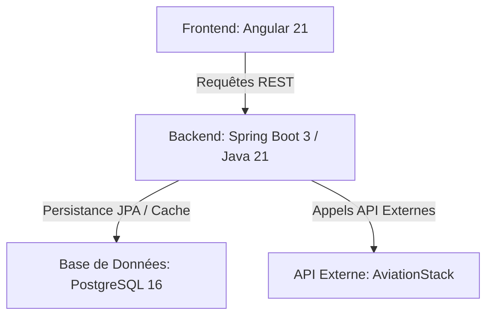

# SkyBook — Système de Réservation de Vols (Flight Booking)

SkyBook est une application web moderne et performante de recherche et de réservation de vols. Le projet repose sur une architecture robuste séparant un client web riche (Angular) et un serveur d'API REST (Spring Boot), le tout orchestré et déployable rapidement via Docker.

---

## 🚀 Fonctionnalités Clés

### 👤 1. Authentification & Gestion des Comptes
* **Inscription et Connexion** : Création sécurisée de compte utilisateur avec contrôle d'accès.
* **Profil Utilisateur** : Sauvegarde des informations personnelles (nom, prénom, ville, pays, téléphone).
* **Gestion des Rôles** : Distinction entre les rôles **Utilisateur (USER)** et **Administrateur (ADMIN)**.

### ✈️ 2. Recherche et Cache de Vols (Intégration d'API)
* **Recherche de Vols** : Saisie des aéroports de départ et d'arrivée (codes IATA).
* **Moteur de Cache Intelligent** :
  * Si la recherche correspond exactement à un trajet enregistré localement dans **PostgreSQL**, l'application sert les données depuis la base locale pour économiser le quota de requêtes de l'API externe.
  * Si le trajet n'est pas en cache, l'application interroge l'API externe **AviationStack**, affiche les résultats et les enregistre automatiquement dans la base de données locale (cache) pour les requêtes futures.
  * Les recherches partielles (préfixes) s'effectuent uniquement en local pour optimiser la rapidité.

### 📅 3. Tunnel de Réservation
* **Formulaire Passager** : Saisie du nom, e-mail, genre, date de naissance, nationalité et numéro d'identité.
* **Options de Voyage** : Sélection de la classe de voyage (Économique / Business), choix du siège et choix des options de bagages supplémentaires.
* **Calcul Dynamique du Prix** : Calcul du coût total en fonction de la classe et des options choisies.
* **Annulation** : Possibilité pour l'utilisateur d'annuler sa réservation directement depuis son tableau de bord, à condition que le vol n'ait pas encore été effectué (`FLEW`).

### 📊 4. Tableau de Bord Administrateur (Admin Dashboard)
* **Statistiques Globales** : Chiffre d'affaires total du site, nombre total de réservations, panier moyen et nombre d'utilisateurs inscrits.
* **Gestion des Réservations** : Visualisation de l'ensemble des réservations du système.
* **Mises à Jour** : Possibilité de marquer un vol comme effectué (`FLEW`), verrouillant ainsi les modifications.

---

## 🛠️ Architecture Technique

Le projet utilise les technologies suivantes :



### 💻 Frontend (Angular)
* **Framework** : Angular v21.2
* **Serveur de test** : Vitest
* **Design** : Interface épurée et moderne utilisant les icônes Tabler Icons et une typographie Inter soignée.
* **Composants Principaux** :
  * `flights` : Moteur de recherche et résultats.
  * `booking-flow` : Formulaire de réservation et de paiement simulé.
  * `booking-history` : Historique personnel de l'utilisateur connecté.
  * `admin-dashboard` : Statistiques de revenus et liste d'administration pour les administrateurs.
  * `login` / `register` : Formulaires de connexion et de création de compte.

### ⚙️ Backend (Spring Boot)
* **Framework** : Spring Boot 3 (Java v21)
* **Gestionnaire de dépendances** : Maven
* **Sécurité & CORS** : Gestion des accès par jetons (tokens d'API) et configuration CORS pour la liaison avec le frontend.
* **Architecture du code** :
  * `controller` : Exposition des endpoints REST (`/api/bookings`, `/api/flights`, `/api/auth`, etc.).
  * `service` : Logique métier (traitement des réservations, validation des tokens, calculs des stats admin).
  * `model/entity` : Définition des tables relationnelles (`User`, `Flight`, `Booking`, `Payment`, `Review`).
  * `model/repository` : Couche d'accès à la base de données (Spring Data JPA).
  * `model/dao` : Implémentation du système de cache local et d'appels à l'API **AviationStack** à l'aide de `RestTemplate`.

---

## 🗂️ Structure du Projet

```text
Flight-book/
├── backend/                       # Code Source du Backend (Spring Boot)
│   ├── src/main/java/...          # Code source Java (Controllers, Services, Entities)
│   ├── src/main/resources/        # Fichiers de configuration (application.properties)
│   ├── Dockerfile                 # Image Docker multi-étape pour le Backend
│   └── pom.xml                    # Fichier de dépendances Maven
├── frontend/                      # Code Source du Frontend
│   ├── flight-booking-frontend/   # Application Angular
│   │   ├── src/app/components/    # Composants de pages (login, flights, admin...)
│   │   ├── src/app/app.css        # Styles globaux & Design System
│   │   └── package.json           # Dépendances npm & scripts Angular
│   └── Dockerfile                 # Image Docker pour le Frontend
├── docker-compose.yml             # Orchestration locale (PostgreSQL, Spring, Angular)
└── README.md                      # Documentation du Projet (Ce fichier)
```

---

## 🚀 Démarrage Rapide avec Docker Compose

Le moyen le plus simple de démarrer l'ensemble de l'écosystème (Base de données + Backend + Frontend) est d'utiliser Docker.

### Préréglages
Assurez-vous d'avoir créé un fichier `.env` à la racine du projet contenant votre clé d'API AviationStack :
```env
FLIGHT_API_KEY=votre_cle_api_aviationstack
```

### Lancement
1. Exécutez la commande suivante à la racine du projet pour construire et lancer les conteneurs :
   ```bash
   docker-compose up --build
   ```
2. Accédez à l'application :
   * **Frontend** : [http://localhost:4200](http://localhost:4200)
   * **Backend API** : [http://localhost:8080](http://localhost:8080)
   * **Base de données PostgreSQL** : Accessible sur le port `5432`

---

## 💻 Développement Local (Sans Docker)

Si vous souhaitez modifier le code en direct avec rechargement automatique :

### 1. Démarrer PostgreSQL
Installez et lancez une instance PostgreSQL locale ou utilisez un conteneur Docker uniquement pour la base :
```bash
docker run --name flight_db -p 5432:5432 -e POSTGRES_DB=flightdb -e POSTGRES_USER=user -e POSTGRES_PASSWORD=password -d postgres:16-alpine
```

### 2. Configurer le Backend
Renseignez les variables d'environnement dans votre IDE ou système :
* `FLIGHT_API_KEY` : Votre clé API
* `SPRING_DATASOURCE_URL` : `jdbc:postgresql://localhost:5432/flightdb`
* `SPRING_DATASOURCE_USERNAME` : `user`
* `SPRING_DATASOURCE_PASSWORD` : `password`

Lancez le backend avec Maven ou votre IDE depuis le dossier `backend` :
```bash
cd backend
mvn spring-boot:run
```

### 3. Configurer et démarrer le Frontend
Depuis le dossier du frontend Angular :
```bash
cd frontend/flight-booking-frontend
npm install
npm run start
```
L'application sera accessible sur [http://localhost:4200](http://localhost:4200) avec rechargement automatique à chaque modification.
